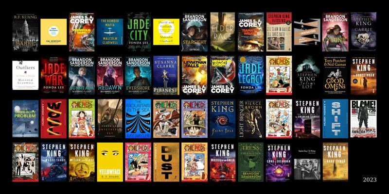
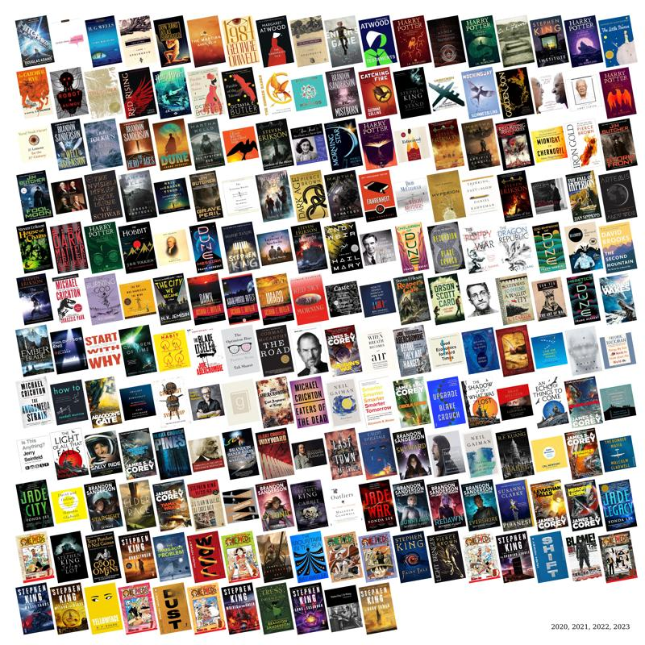

# gr

A collection (currently size of one) of scripts used to scrape data from Goodreads.

# Setup

```bash
# create virtual environment
python3 -m venv .venv
# activate virtual environment
source .venv/bin/activate
# install all dependencies
pip install -r requirements.txt
```

## gr-collage.py

Script to create a collage of book covers given a link to a Goodreads shelf RSS URL.

Examples:

```bash
python gr-collage.py --shelf 2023 --background-color black --title-color white --size 800x400
```




```bash
python gr-collage.py --shelf 2020 2021 2022 2023 --size 800x800 --rotation 5
```


